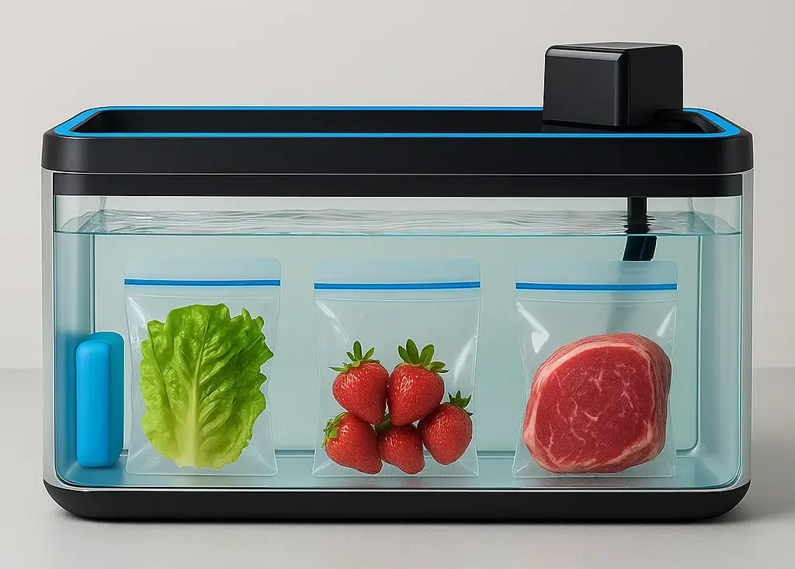
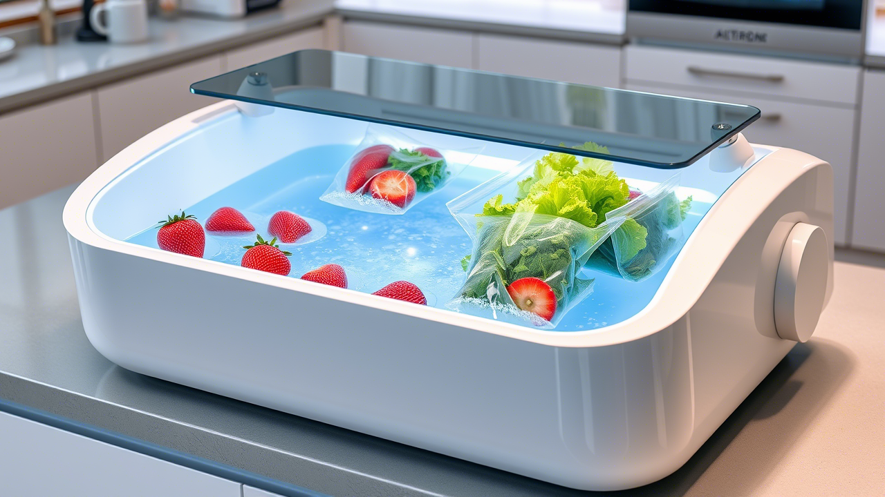
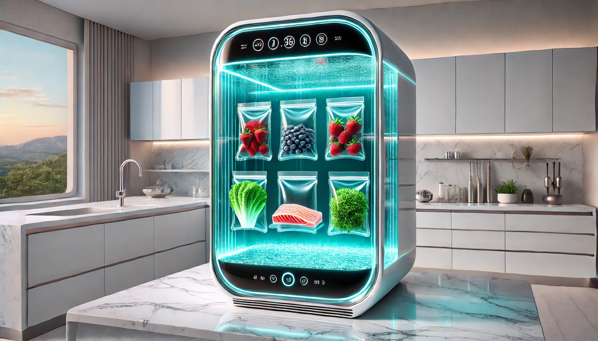

# Liquid Fridge: Another Food Preservation System

Liquid-based food preservation system that extends freshness for weeks by eliminating oxygen exposure. 

**Why (the problem)**

- Traditional refrigeration consumes excessive energy and takes up significant space
- Food spoils quickly due to oxygen exposure, leading to waste and frequent grocery trips
- Current preservation methods are expensive and inaccessible to many households in developing countries
- Rising food costs make food waste economically painful for families

/// caption
AI generated concept
///

**What (the idea)**

A horizontal aquarium-like tank filled with water where food is stored in special air-expelling bags, creating a low-oxygen environment that dramatically slows spoilage - affordable food preservation for everyone.
**How (v0 / MVP)**

The smallest version that proves value: a 20-gallon glass aquarium tank ($50-100) with water, food-safe zip-lock bags, ice packs for cooling, and a small water pump ($20-30) for circulation. Users can test preservation effectiveness with common foods like lettuce, strawberries, and meat within days.

/// caption
AI generated concept
///

**How (tech/ops)**

- **Hardware**: Standard aquarium tanks (20-30 gallons), food-safe plastic bags with one-way valves
- **Cooling**: Ice packs (free) or mini aquarium chiller ($50-100) for temperature control  
- **Water system**: Tap water with food-grade salt/vinegar, small circulation pump
- **Maintenance**: Water changes every 2-3 weeks, tank cleaning with soap and water
- **Distribution**: Partner with aquarium suppliers and kitchen retailers
- **Cost structure**: $100-150 total setup, comparable to budget mini fridges

**Prior art & investigations**

- **Vacuum sealing**: Expensive machines ($100-300), single-use bags, complex operation
- **Sous vide storage**: Professional technique but requires specialized equipment and skills
- **Traditional preservation**: Canning, pickling, dehydrating - time-intensive and changes food texture
- **Research findings**: Oxygen is primary spoilage factor; water displacement effectively removes air
- **Market gap**: No affordable, accessible low-oxygen food storage for home use

/// caption
AI generated concept
///

**Risks & open questions**

- **Water contamination**: Mitigated by circulation pump, salt/vinegar additives, and regular water changes
- **Food safety regulations**: Need to research FDA guidelines for water-based food storage
- **Bag durability**: Testing required for various bag materials and valve designs under water pressure
**Next step & call to action**

## Next step:
Build MVP prototype with 20-gallon tank and test preservation times with 5 common foods over 30 days.